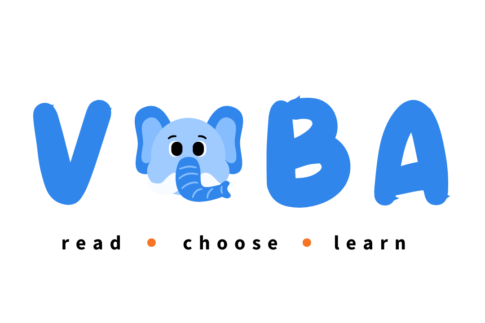

# Voba

Helping elementary school students learn vocabulary through create-your-own-adventure stories. A project for Treehacks 2024.

[voba-stories.web.app/](https://voba-stories.web.app/)

## Inspiration

According to the National Assessment for Educational Progress (NAEP), ⅔ of fourth grade students are not meeting a proficient reading level. This has been the result of a combination of reduced public education funding, the impact of the COVID-19 pandemic and online earning, and the ongoing debate about the use of phonics vs. whole language for literary education. After talking to a teacher from Seattle, we identified some firsthand challenges that educators face due to this decline – a strong need for improvement in reading comprehension for proficiency in other subjects was labeled as a top concern.

However, we thought that it was still important to continuously integrate technology in students’ lives, especially with many classrooms already adopting tablets and computers in class. Thus, why not take advantage of the tools of the future? With these thoughts in mind, we created Voba – a tool to make learning vocabulary fun via a choose-your-own adventure game.

## What it does

Voba is an educational tool that allows students to create their own stories based off of teacher-assigned or self-added vocabulary words. By allowing students to directly engage with storytelling, we allow them to engage more directly with the vocabulary and make every experience different. With the number of possibilities that come with every direction a story could take, it allows for unlimited fun!

Voba supports 3 different learning modes:

1. **Creative Mode**: This mode  is a free-for-all story generation party, where the AI agent generates a starter story based on the vocabulary checklist and multiple options to continue the story with sentences that utilize the vocabulary in the list. This encourages students to actively and fearlessly try using new words while introducing unfamiliar vocabulary through the way they were meant to be used.

2. **Test Mode**: This mode employs a multiple-choice system where instead of generating sentences which ALL work, the agent will come up with 3 incorrect uses of the vocabulary and 1 correct use. If the student gets it wrong, the companion (Vovo) will help them understand why the answer was incorrect.

3. **Mixed Mode**: This mode combines elements of both Creative and Mixed mode. Here, we have 2 correct and 2 incorrect answers, which allows students both the ability to explore but also to understand the use of vocabulary through varied contexts.

In addition to this main learning mode, we also incorporated the following to support learning and information retention:

1. **Highlighted Key Words + Definitions**: In every generated sentence, the words on the vocabulary list will be highlighted. When the student hovers over it, it will show the definition of the word, helping them understand and process how it is used in that context.

2. **Audio**: Utilizing OpenAI’s text-to-speech model, we implemented audio for every sentence so students can also hear how the word is used in the sentence. This reinforced another pillar of learning vocabulary – the auditory versions. It can also help them grasp pronunciation and tone.

3. **Vocabulary List View:** We implemented both a ‘student’ and ‘teacher’ mode. If a student simply wants to review vocabulary words, then they can view the “vocabulary list” from their home page and click through it to see that and a definition of the word. If they click on the word, then it will say the pronunciation of the word out loud. If you are entered as a teacher, then you can add in words.

4. **Vocabulary Word Review Tracking**: When playing the game, the application and the AI agent will keep track of which words the student has reviewed and how often, providing both the student and the teacher (for progress tracking purposes) a way to see their progress visually. The AI Agent can also use this data to know which words to review, allowing it to focus on words that are in-need of review and bring up words that haven’t been used in a while.

5. **Mascot Companion**: For each mode, we have a mascot companion to accompany the student on their adventure! Vovo the Elephant provides encouragement upon correct answers, completion of the story, and provides feedback about incorrect answers in Quiz and Mixed mode. Having a cute mascot helps put the students at ease and become more engaged in the story.

6. **Advanced Sentence Generation**: For every sentence generated, the agent can also use 1-2 words, showing the students how multiple difficult vocabulary words can be combined in a sentence.

With a combination of these features, it creates a fun, seamless experience for students to learn new words and reinforce the learning. It also offers a unique take on the creative process with story generation and AI as well, as it also encourages students to learn the storytelling process!

## How we built it

**Frontend:** React, TailwindCSS 

**AI:** OpenAI Text-to-Speech, OpenAI GPT-4, LangChain

**API:** FastAPI, Lambda 

**Infrastructure / Management:** AWS Lambda, AWS S3, Firebase hosting

**Design:** Canva

## Challenges we ran into

**Front-end and back-end integration**: It was difficult to piece together the infrastructure, frontend, and backend components, especially with all of us working on different parts at the same time.

**Passing and Serving Audio Files via. API:** Since none of us had ever worked with text-to-speech AIs, it was difficult to figure out the best way to ensure that the entire sentence generated got to the audio files and then sent back to the app.

**Prompt Generation:** It’s difficult to get the correct use of the word according to the given definition, as many words have many different definitions! On top of this, we had to ensure that the AI didn’t come up with words that were too complex for a 2nd grader to understand. Lastly, we had to ensure that the story would follow a kind of “storytelling structure,” with an introduction, climax, conclusion, but still be interesting instead of formulaic.

## Accomplishments that we're proud of

Two of our group members were first-time hackathon participants, so we’re really proud of how much everyone was able to contribute to both the brainstorming and implementation of the project. Each member of the team took charge of a specific part and learned something new! 

1. **TLDR**; we’re super proud that we built a full-stack project with multiple APIs! 
2. **LangChain**: None of us had ever used LangChain before, so the majority of our debugging involved LangChain issues and how we maintained the use of the vocabulary words, frequency of word use, keeping it at the appropriate level, and more.
3. **Child friendly UI design**: We felt that we were able to effectively capture this! In our research, we saw that a lot of child-focused websites (i.e. National Geographic Kids, PBS Kids, etc) were very sloppily designed. We wanted to strike the balance between fun and bold but also structured. 
4. **Fun!:** All of us were really pleasantly surprised about how fun this entire app is, even for us as college students. It brings back a kind of nostalgia for childrens’ stories while being genuinely engaging enough for us to play around with it for hours without fail (We coincidentally got so many pirate stories. So many.)

We pushed ourselves a lot out of our comfort zone with the scope of the project. Most of us only have ever had some front-end experience, so creating a full-stack project was extremely new to us, especially with 2 new hackers! 

## What we learned

1. How to design for a specific audience – building for elementary school students is much different than building for high school / college students. A lot of the coding, colors, design, and prompt engineering had to keep our young users in mind. 

2. Everyone on the team learned a new technology, whether it’s on the back-end, front-end, or AI / infrastructure side.

3. Effective communication and prioritization of tasks – we were extremely ambitious and had to scale and alter the idea as it developed further and we began programming. 

## What's next for Voba

Looking ahead, we envision Voba evolving into a more comprehensive tool for students to have fun and learn vocabulary on their own and as a tool for instructors to use.

**Teacher Portal**: A dedicated dashboard for teachers to manage classrooms, track class and student progress, assign grades, and offer reward incentives.

**Expanded Learning Models**: We could introduce more game modes that test different things, for instance, a pure quiz mode or a ‘kid’ mode.

**Multiple-meaning words**: Include multiple definitions for each word

**UI/UX Enhancements for Accessibility**: Implementing research-backed strategies to help students learn, especially those with learning impediments, disabilities and more. This could involve:
- Expanding the audio function for blind and visually-impaired students
- Integration of illustrations for a more engaging story
- Color-blind mode, slower paced assignments, difficulty adjustments
- Progress Tracker + Badges: To encourage students to play, we could implement some more incentives that either a teacher could implement or a student could obtain on their own time. 
Saving Stories: After students have created their stories, we’d love to implement an export function to allow them to continue building on them or to share it with their friends and family! 
